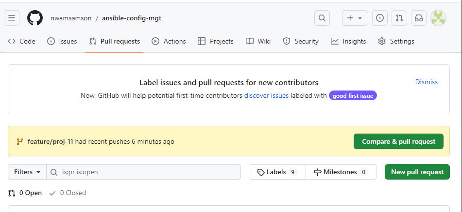
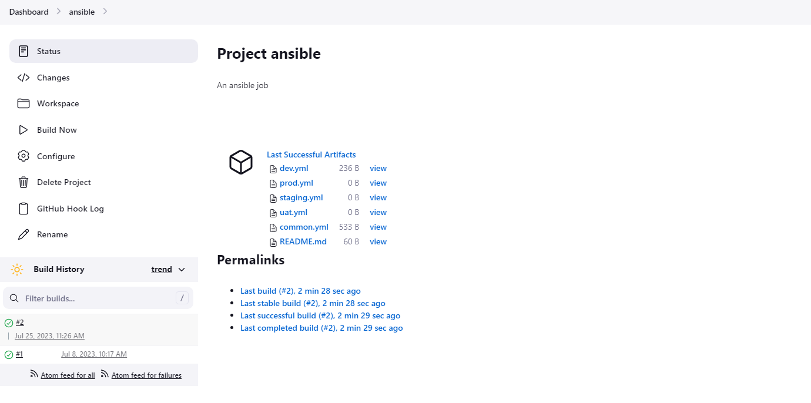

# ANSIBLE CONFIGURATION MANAGEMENT

In this project, I'll be using ansible to automate setting up servers, and configuring them. 

Ansible is a configuration management tool used by devops engineers to automate the process of server configuration and management

# ARCHITECTURE


# INSTALL AND CONFIGURE ANSIBLE ON THE JENKINS SERVER

Ansible is configured and installed on the jenkins server used in previous projects. The following commands are used: 
```
sudo apt update

sudo apt install ansible

```


The jenkins build job is configured to save my repository content everytime it changes. A new freestyle project in jenkins is made and it is pointed to my repository called 'ansible-config-mgt'. A webhook trigger is configured and a post-build job to save all (**) files is done as well. 

In order to avoid re-configuring the webhook triggers, an elastic ip is used to ensure that the ip address does not change with every server restart. 


# ANSIBLE DEVELOPMENT

My dev environment is setup on visual studio code to make the process of building my ansible code and debugging easier. 
A new branch is created that will be used for the development of the new feature called 'feature/proj-11'. I checkout into the newly created feature branch and begin my ansible development. I create a directory called playbooks to store my playbook files and I create another directory called inventory used to keep my hosts organised. Within the inventory folder I create an inventory file for each environment (development, staging, testing and production) respectively. The dev.yml and common.yml are updated to reflect the hosts to be targeted and the tasks to be performed. 


Ansible uses port 22 by default, which means it needs to ssh into target servers from the jenkins-ansible host, and for this I'l be implementing the ssh-agent using the following command.
The codes above in the dev.yml is the private ip addresses of the target hosts while the common.yml file is the playbook file intended to install wireshark utility (or make sure it is updated to the latest version) on the servers and it uses root to perform theses tasks with their respective package managers


```
eval 'ssh-agent -s'
ssh-add <path to private key>

```

confirm the key has been added using the command `ssh-add -l`

A test ping confirms that the ansible server can connect to the hosts


The codes are staged and commited to github. A pull request is made, reviewed and is merged with main branch. 





Once the code changes are updated on the main branch - jenkins will do its job and save all the files (builds) on the jenkins server. 



Confirm on one of the servers if wireshark has been installed after running the ansible code `ansible-playbook -i inventory/dev.yml playbooks/common.yml`


